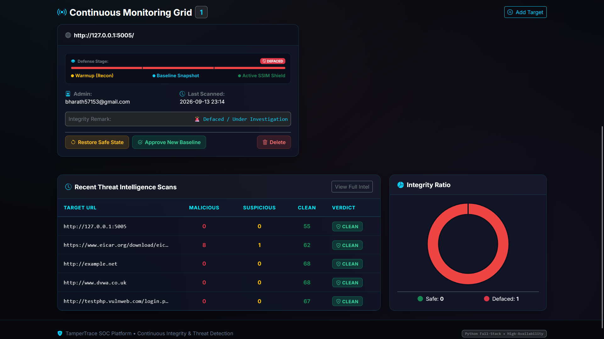
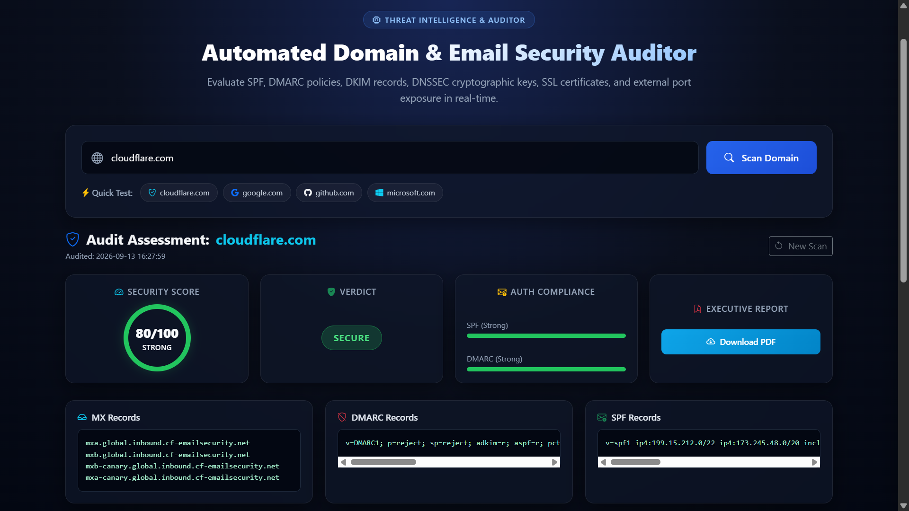
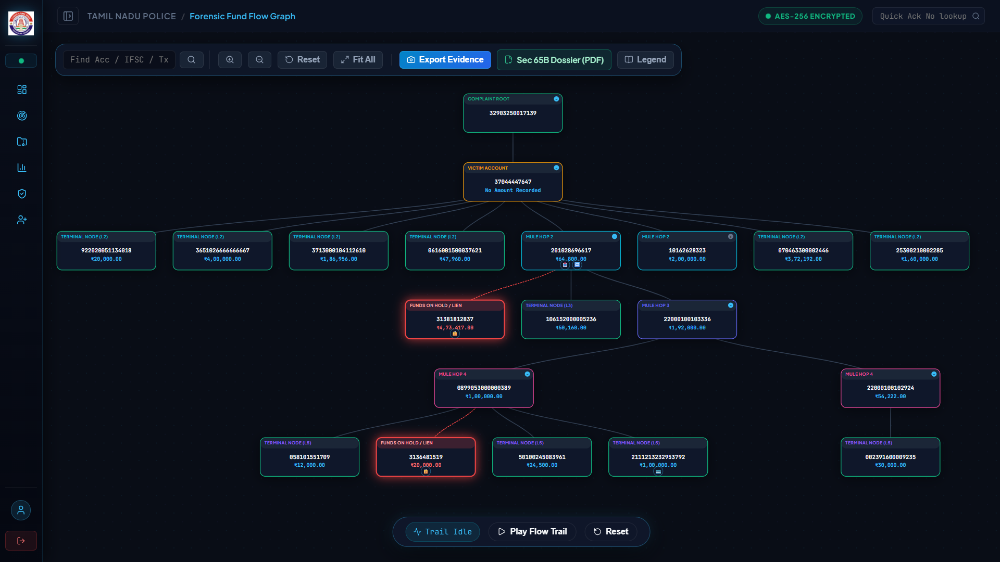

# 🛡️ Indra Kumar V

**Software Developer &amp; Cybersecurity Engineer**  
*B.E. Computer Science (Cyber Security) · 2027 Graduate · CGPA 8.04*

I build secure backend systems, full-stack applications, cybersecurity automation tools, and threat-intelligence platforms.  
My work combines software engineering, cybersecurity, and problem solving, with hands-on experience across Java, Python, Spring Boot, React, Flask, SQL, threat intelligence, network analysis, and security automation.

[🌐 Portfolio](https://indra-kumar-portfolio.vercel.app/) · [💻 GitHub](https://github.com/Indraik) · [🧩 LeetCode](https://leetcode.com/u/Indrakumar_V/) · [🛡️ TryHackMe](https://tryhackme.com/p/indra02) · [💼 LinkedIn](https://www.linkedin.com/in/indra0210/)

---

## 🚀 What I Build

- 🔐 **Cybersecurity and threat-intelligence platforms**
- 🌐 **Full-stack web applications**
- ⚙️ **Security automation and detection workflows**
- 🧩 **Backend systems and REST APIs**
- 📊 **Security analytics and investigation dashboards**
- 💻 **Algorithmic problem-solving and DSA solutions**

---

## 🛠️ Technical Skills

### Software Engineering
`Java` · `Python` · `Spring Boot` · `Flask` · `React` · `REST APIs` · `PostgreSQL` · `MySQL` · `Git`

### Cybersecurity
`Threat Intelligence` · `OSINT` · `OWASP Top 10` · `Network Forensics` · `SIEM` · `Security Automation`

### Security Tools & Technologies
`Splunk` · `Wireshark` · `Nmap` · `Burp Suite` · `Metasploit` · `OWASP ZAP` · `VirusTotal` · `AbuseIPDB` · `ThreatFox` · `YARA`

### Security & Network Concepts
`DNSSEC` · `SPF` · `DKIM` · `DMARC` · `TLS/SSL` · `IOC Correlation`

### Core Computer Science
`Data Structures & Algorithms` · `Problem Solving` · `Object-Oriented Programming` · `DBMS` · `Computer Networks`

---

## ⭐ Featured Projects

### 1. TamperTrace Platform
**Automated Website Integrity & Defacement Detection**  
A security platform designed to detect unauthorized website modifications using visual and semantic analysis.

#### Key capabilities
- SSIM-based visual integrity comparison
- Semantic HTML analysis
- VirusTotal API v3 integration
- Trusted baseline backups
- Tampering alerts
- Website rollback and recovery

**Tech:** `Python` · `Flask` · `SSIM` · `VirusTotal API`  
🔗 **[View Repository](https://github.com/Indraik/TamperTrace_Platform)**

#### Preview

---

### 2. Asset-Centric Threat Intelligence
**Automated Cyber Threat Intelligence & IOC Correlation**  
A threat-intelligence automation platform that aggregates and correlates indicators from multiple security feeds.

#### Key capabilities
- AbuseIPDB integration
- URLhaus integration
- ThreatFox integration
- Concurrent threat-feed ingestion
- IOC normalization and correlation
- Automated YARA rule generation
- Firewall blocklist generation

**Tech:** `Python` · `Flask` · `Threat Intelligence` · `OSINT` · `YARA`  
🔗 **[View Repository](https://github.com/Indraik/AssetCentric-CTI-Automation)**

---

### 3. Domain Security Scanner
**Automated Domain Security Posture Assessment**  
A security assessment tool for analyzing DNS, email authentication, exposed services, and TLS configuration.

#### Key capabilities
- SPF analysis
- DKIM analysis
- DMARC analysis
- DNSSEC verification
- MX analysis
- Concurrent port scanning
- SSL/TLS security checks
- Automated PDF security reports

**Tech:** `Python` · `Security Automation` · `DNS` · `Networking`  
🔗 **[View Repository](https://github.com/Indraik/Domain_Security_Scanner)**

#### Preview

---

### 4. FundTrail Analysis Tool
**Financial Fraud Investigation & Fund-Flow Analysis Platform**  
A backend and visualization system developed during my internship with the **Tamil Nadu Cyber Crime Wing** for organizing and analyzing financial fraud investigation data.

#### Key capabilities
- Financial fraud case management
- Transaction analysis
- Complaint and officer management
- Python/Excel data normalization
- MySQL-backed investigation data
- D3.js fund-flow visualization
- Investigation analytics

**Tech:** `Python` · `Flask` · `MySQL` · `D3.js`  
> *Note: Public demonstrations use sanitized/demo data and do not expose confidential investigation information.*

#### Preview

---

## 📂 Additional Projects

### CyberQuiz
Full-stack cybersecurity quiz platform built using React, Spring Boot, and PostgreSQL.  
🔗 **[View Repository](https://github.com/Indraik/Cyber-Quiz)**

### Task Master Pro
Full-stack task and workflow management application.  
🔗 **[View Repository](https://github.com/Indraik/Task_Master_Pro)**

---

## 💼 Experience

### Cyber Crime Intern
**Tamil Nadu Cyber Crime Wing**  
Worked on financial fraud investigation workflows and developed the FundTrail Analysis Tool for organizing and analyzing investigation data.

**Key areas:**
- Financial transaction analysis
- Investigation data management
- Log analysis
- Transaction monitoring
- Fund-flow visualization

---

### Cybersecurity Intern
**Hackup Technology**  
Worked on web and network security assessment activities.

**Key areas:**
- OWASP Top 10
- Vulnerability assessment
- Wireshark network analysis
- Abnormal request analysis
- Security documentation and reporting

---

## 🧩 Coding & Cybersecurity

### LeetCode
- **468+ Problems Solved**
  - **162** Easy
  - **231** Medium
  - **75** Hard
- Java as primary language
- Top 6% global ranking  
🔗 **[View LeetCode Profile](https://leetcode.com/u/Indrakumar_V/)**

---

### TryHackMe
- **Top 10% Global Ranking**
- **56+** rooms solved
  - **30+** SOC & Defense
  - **15+** Web & OWASP
  - **11+** Offensive / CTF  
🔗 **[View TryHackMe Profile](https://tryhackme.com/p/indra02)**

---

## 🏆 Certifications, Awards & Research

My portfolio includes certifications, project awards, hackathon participation, and research/conference work across cybersecurity and software engineering:
- **Best Project Award** — Domain Security Analysis (Intra-College Expo)
- **IEEE RICE-2025** — Published research author
- **Smart India Hackathon (SIH 2024)** & **Pentathon 2025** — Active participant
- **Industry Certifications** — NPTEL Elite, EC-Council Cyber Security Fundamentals

For the latest details and supporting credentials:  
👉 **[View Full Portfolio](https://indra-kumar-portfolio.vercel.app/)**

---

## 🌐 Portfolio

Explore my complete interactive portfolio for:
- Project demonstrations & interactive proof-of-work screenshot galleries
- Technical skills & categorized competencies
- Professional experience
- Awards, certifications & research credentials
- Real-time coding statistics (LeetCode & TryHackMe)
- Contact form & quick actions

👉 **[indra-kumar-portfolio.vercel.app](https://indra-kumar-portfolio.vercel.app/)**

---

## 📬 Connect

- 📧 **Email:** [indrakumarvelusamy@gmail.com](mailto:indrakumarvelusamy@gmail.com)
- 💼 **LinkedIn:** [linkedin.com/in/indra0210](https://www.linkedin.com/in/indra0210/)
- 💻 **GitHub:** [github.com/Indraik](https://github.com/Indraik)
- 🧩 **LeetCode:** [leetcode.com/u/Indrakumar_V](https://leetcode.com/u/Indrakumar_V/)
- 🛡️ **TryHackMe:** [tryhackme.com/p/indra02](https://tryhackme.com/p/indra02)

> *"Building secure systems. Breaking assumptions."*

---

